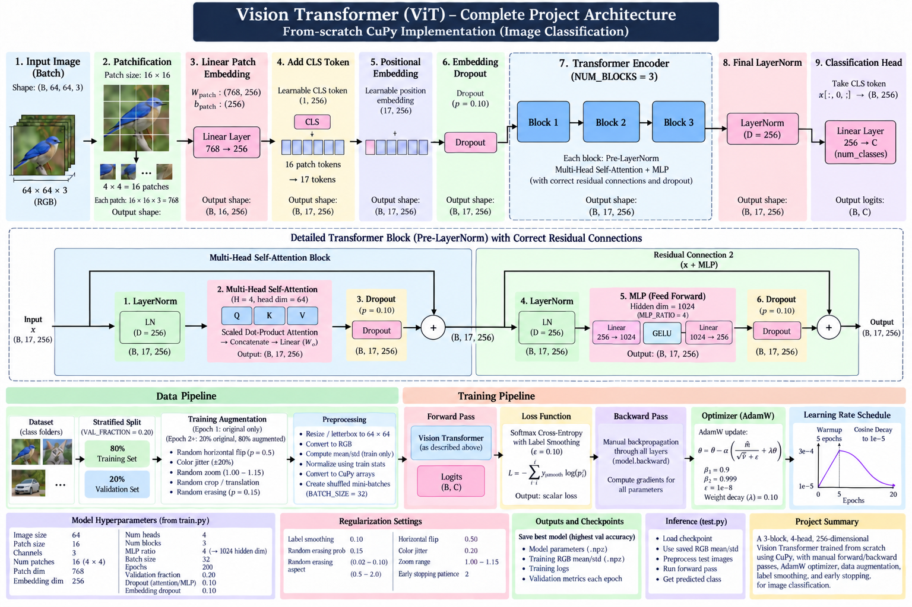
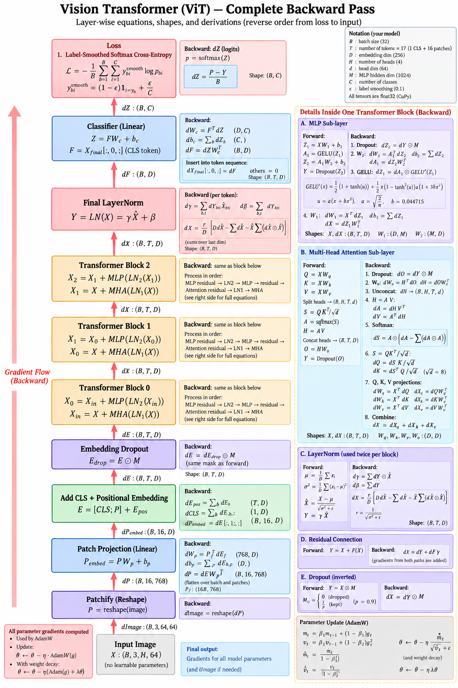
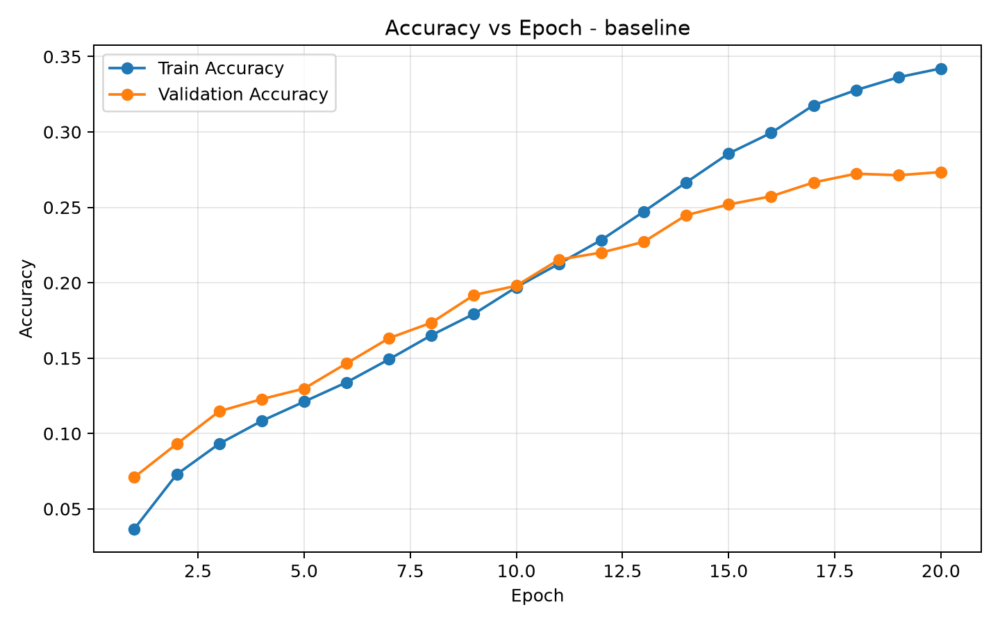
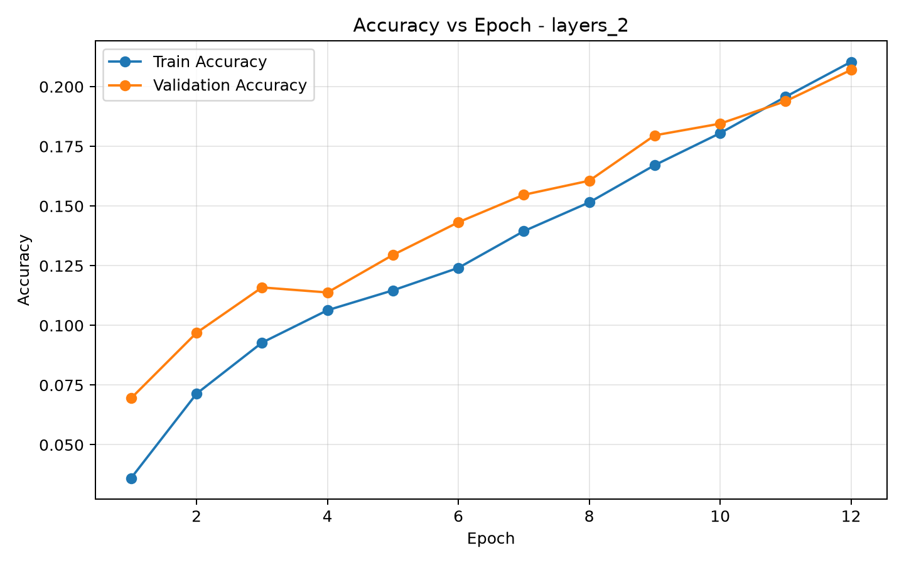
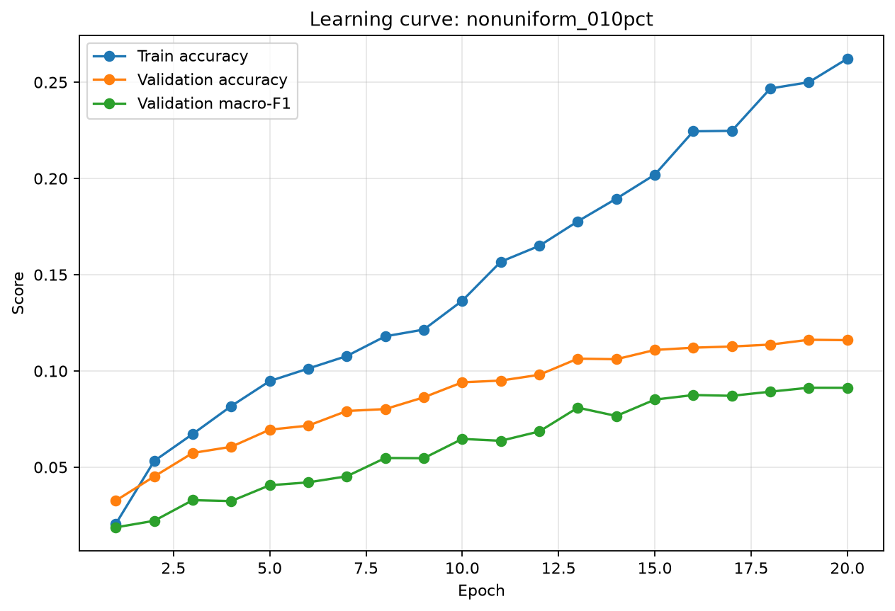
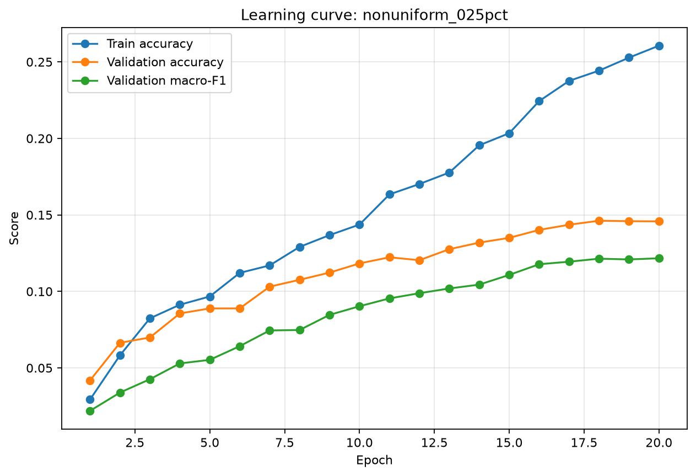
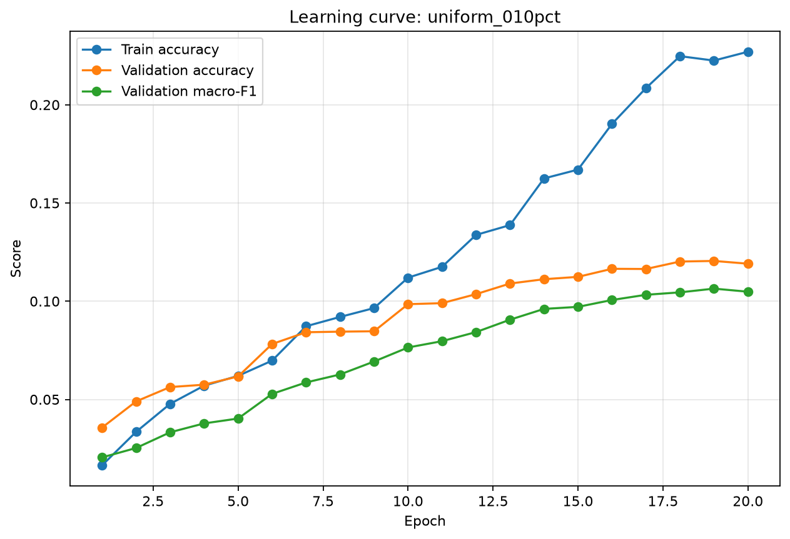
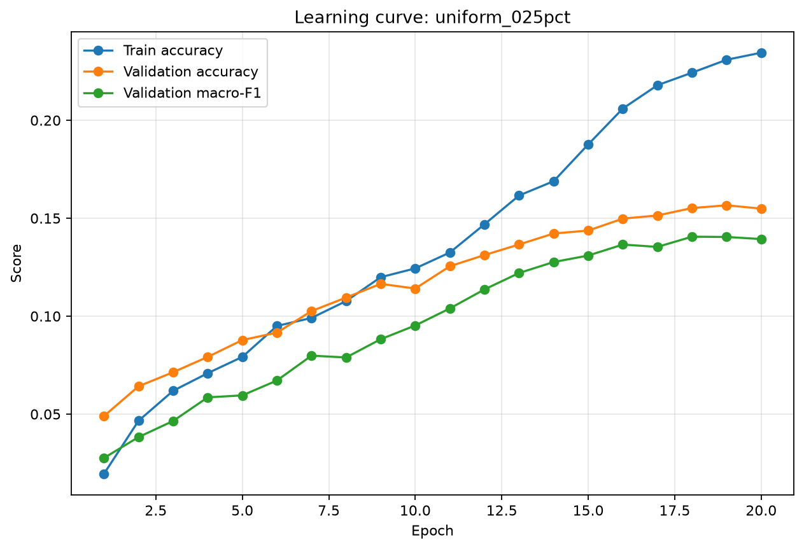

# Vision Transformer: Attention, Model Scaling, and Data Scaling

This project implements a **Vision Transformer (ViT) from scratch** for image classification and investigates the effects of **model scaling** and **training-data scaling** on classification performance and computational cost.

---

# Core Component 01: Attention Implementation

## Objective

Implement a **Vision Transformer architecture** and train it **end-to-end for image classification** on the provided dataset.

The Vision Transformer architecture must contain at least the following components:

- Image tokenizer
- At least **two Transformer blocks**
- Multi-Head Self-Attention
- At least **2 attention heads**

Each Transformer block must contain:

- Normalization layer
- Skip / residual connections
- Multi-Layer Perceptron (MLP)
- Query projection
- Key projection
- Value projection
- Multi-Head Self-Attention

## Implementation Requirements

The complete architecture must be trainable **end-to-end**.

The following computations are implemented manually:

- Forward propagation
- Backward propagation
- Gradient computation
- Parameter updates

> **Important:** The implementation does not rely on pre-existing implementations of Transformer layers, attention layers, or automatic differentiation.

## Architecture



## Backward Gradient Flow

The backward pass propagates gradients from the classification loss through the classification head, Transformer blocks, attention mechanism, MLP layers, normalization layers, positional embeddings, and patch projection.



---

# Core Component 02: Model Scaling

## Objective

In this experiment, we investigate the effect of **model capacity** while keeping the **training dataset fixed**.

Controlled experiments are performed where only the intended architectural parameter is changed while all other experimental conditions are kept as consistent as possible.

The architectural parameters investigated include:

- Number of Transformer layers
- Number of attention heads
- Embedding dimension
- MLP expansion ratio

The objective is to analyze how scaling different components of the Vision Transformer affects the trade-off between:

> **Classification Accuracy ↔ Computational Cost**

## Metrics

For each experiment, the following metrics are reported:

- Number of parameters
- FLOPs
- MACs
- Training performance
- Validation performance
- Inference latency
- Inference throughput

---

## Experimental Configurations

| Experiment | Configuration | Layers (L) | Heads (H) | Embedding Dim (D) | MLP Ratio |
|---|---|---:|---:|---:|---:|
| 01 | **Baseline** | 3 | 4 | 256 | 4 |
| 02 | Layers 2 | 2 | 4 | 256 | 4 |
| 03 | Layers 4 | 4 | 4 | 256 | 4 |
| 04 | Layers 6 | 6 | 4 | 256 | 4 |
| 05 | Heads 2 | 3 | 2 | 256 | 4 |
| 06 | Heads 8 | 3 | 8 | 256 | 4 |
| 07 | Heads 16 | 3 | 16 | 256 | 4 |
| 08 | Embed 128 | 3 | 4 | 128 | 4 |
| 09 | Embed 192 | 3 | 4 | 192 | 4 |
| 10 | Embed 384 | 3 | 4 | 384 | 4 |
| 11 | MLP Ratio 2 | 3 | 4 | 256 | 2 |
| 12 | MLP Ratio 6 | 3 | 4 | 256 | 6 |

### Baseline Configuration

```text
Layers            = 3
Attention Heads   = 4
Embedding Dim     = 256
MLP Ratio         = 4
```

For every experiment, only one architectural parameter is modified relative to the baseline wherever possible.

---

## Experimental Results

### Baseline Model

**Configuration:** `L = 3, H = 4, D = 256, MLP Ratio = 4`



---

### 2-Layer Model

**Configuration:** `L = 2, H = 4, D = 256, MLP Ratio = 4`



---

# Core Component 03: Data Scaling

## Objective

In this experiment, we investigate the effect of **training-data size** while keeping the **Vision Transformer architecture fixed**.

The same baseline architecture is trained using different percentages of the available training dataset.

The training-data scales include:

- 10%
- 25%
- 50%
- 100%

The experiment also compares two different sampling strategies:

- **Uniform sampling**
- **Non-uniform sampling**

The objective is to study how both **dataset size** and **class sampling strategy** influence classification performance.

## Metrics

For each data scale and sampling strategy, the following metrics are reported:

- Training time
- Training performance
- Validation performance

---

## Sampling Strategies

### 1. Uniform Sampling

**Stratified sampling** retains approximately the same fraction of samples from every class.

This keeps the class distribution of the sampled subset close to the class distribution of the original training split.

```text
Original Dataset
      │
      ▼
Stratified Sampling
      │
      ▼
Approximately Equal Fraction
from Every Class
      │
      ▼
Balanced Training Subset
```

---

### 2. Non-Uniform Sampling

A deterministic **weighted random ordering** is used to favor some classes over others.

Taking the first `N` samples from this ordering creates an intentionally **class-imbalanced subset**.

The class preference assignment is randomized using the fixed project seed so that alphabetical class names do not determine which classes are favored.

```text
Original Dataset
      │
      ▼
Weighted Random Ordering
      │
      ▼
Some Classes Favored
More Than Others
      │
      ▼
Non-Uniform Training Subset
```

---

# Data Scaling Results

## Non-Uniform Sampling

### 10% Training Data



---

### 25% Training Data



---

## Uniform Sampling

### 10% Training Data



---

### 25% Training Data



---

# Summary

The project evaluates a Vision Transformer from three different perspectives:

| Component | Main Question |
|---|---|
| **Core Component 01** | Can a Vision Transformer and its gradients be implemented manually and trained end-to-end? |
| **Core Component 02** | How does changing model capacity affect accuracy and computational cost? |
| **Core Component 03** | How do training-data size and sampling strategy affect classification performance? |

Together, these experiments provide an analysis of the relationship between **Transformer architecture, computational complexity, training-data availability, and classification performance**.